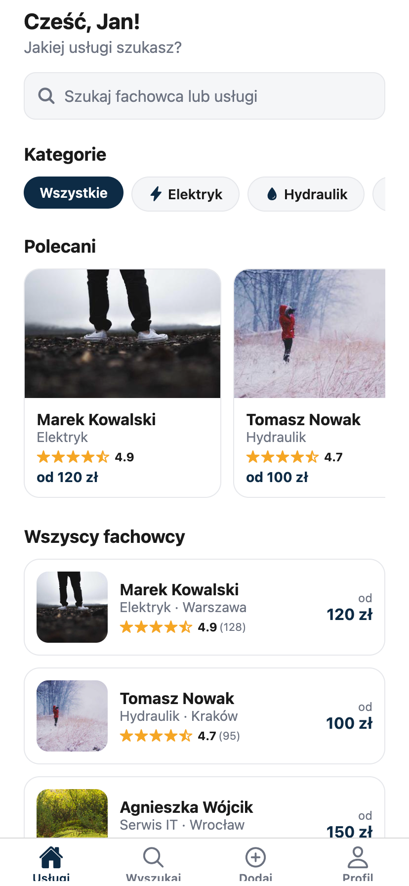
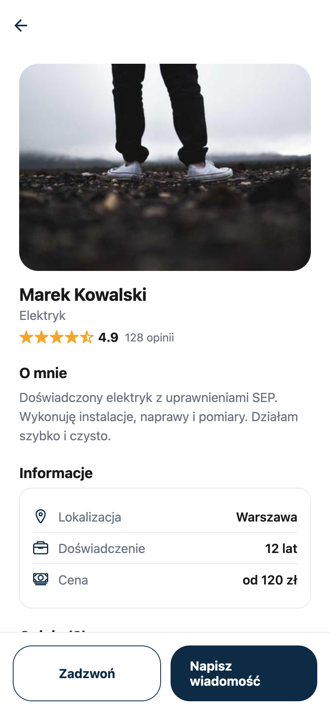
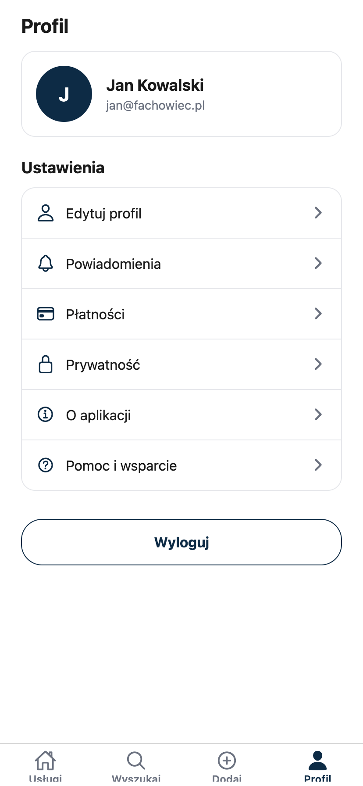
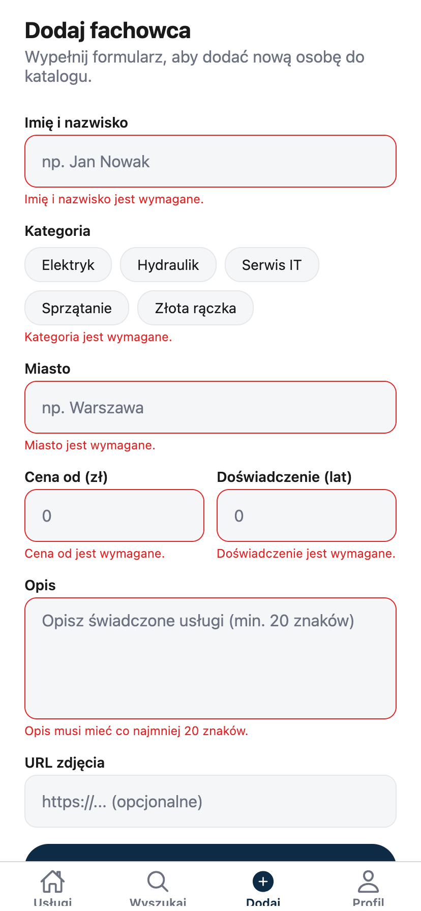

# Fachowiec+

Aplikacja mobilna do szybkiego znajdowania sprawdzonych fachowców – elektryków, hydraulików, serwisantów IT i innych.

## Opis

Użytkownik przegląda katalog fachowców, filtruje po kategorii, wyszukuje, czyta opinie i kontaktuje się bezpośrednio z wykonawcami. Aplikacja umożliwia logowanie, rejestrację oraz dodawanie nowych osób do bazy. Dane przechowywane są lokalnie.

## Funkcjonalności

- Onboarding, logowanie i rejestracja
- Lista fachowców z filtrowaniem po kategorii i wyszukiwarką
- Ekran szczegółów z opiniami i ocenami gwiazdkowymi
- Formularz dodawania nowego fachowca
- Profil użytkownika

## Użyte technologie

- React Native, Expo SDK 56
- TypeScript
- React Navigation (stack + bottom tabs)
- React Query (TanStack Query)
- AsyncStorage

## Instrukcja uruchomienia

```bash
npm install
npm run web
```

### Zrzuty z uruchomionej aplikacji

<p align="center">
  
  
  
  
</p>
